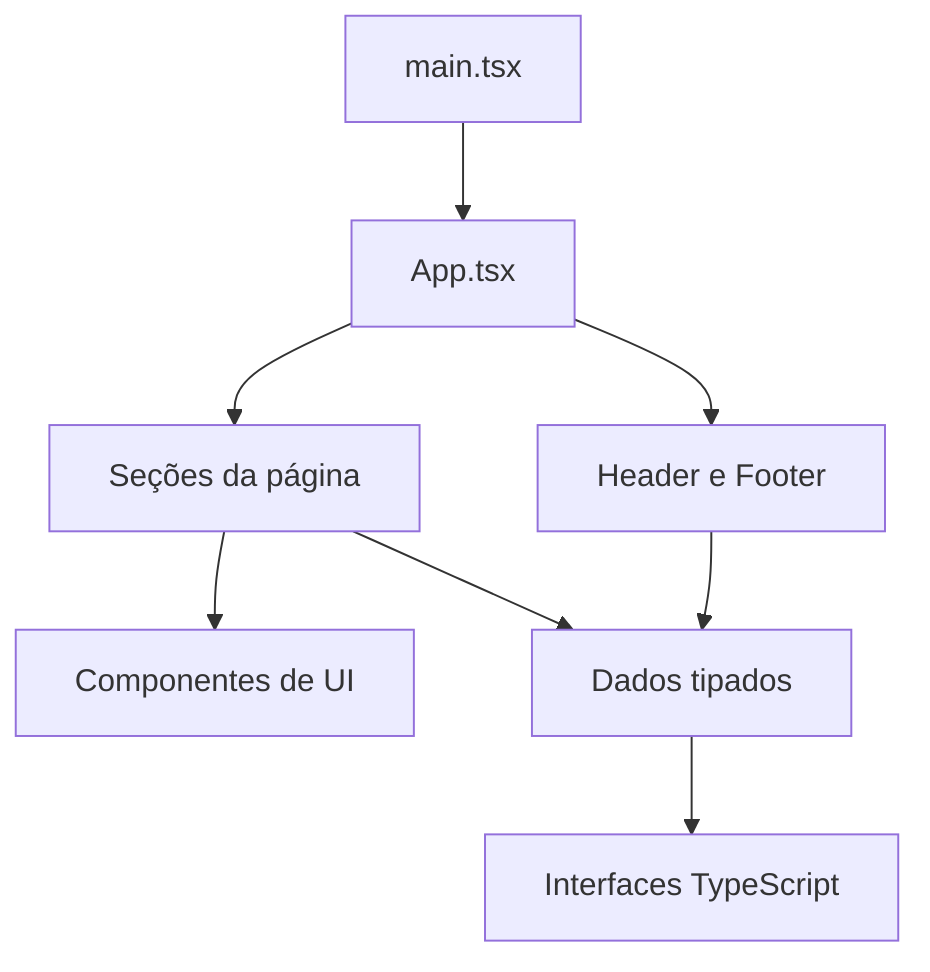

# Monumental Barbearia

[](https://github.com/pedroeduardo36/monumental-barbearia/actions/workflows/ci.yml)
[](https://github.com/pedroeduardo36/monumental-barbearia/actions/workflows/deploy.yml)

Site institucional da **Monumental Barbearia**, localizada no Hotel Manhattan Plaza, em Brasília. O projeto transforma uma referência visual estática em uma experiência web responsiva, acessível e orientada a conversão, com catálogo real de serviços e integração com o fluxo de agendamento do AppBarber.

> **Deploy:** após a ativação do GitHub Pages, o site ficará disponível em
> `https://pedroeduardo36.github.io/monumental-barbearia/`.


## O que este projeto demonstra

- Arquitetura React modular, com separação entre dados, domínio, componentes reutilizáveis, layout e seções.
- TypeScript em modo estrito, com contratos explícitos para serviços, profissionais, galeria, horários e contatos.
- Design responsivo desenvolvido a partir da identidade verde e dourada da marca.
- Acessibilidade com HTML semântico, foco visível, link para pular conteúdo, nomes acessíveis e suporte a `prefers-reduced-motion`.
- Interações progressivas sem dependências pesadas: menu móvel, galeria, header reativo ao scroll e cena 3D controlável.
- Performance com fontes locais, imagens inferiores em carregamento tardio e build otimizado pelo Vite.
- Qualidade automatizada com ESLint, Prettier, TypeScript, teste de navegador e auditoria axe.
- Entrega contínua com GitHub Actions e GitHub Pages.

## Funcionalidades

- Página inicial premium com chamada direta para agendamento.
- Catálogo com 13 serviços, preços e durações consultados no AppBarber.
- Perfis dos profissionais e apresentação institucional.
- Galeria responsiva com miniaturas e controles acessíveis.
- Localização com imagem em perspectiva, zoom e rotação 3D, além de controle de pausa.
- Endereço, expediente, Instagram e WhatsApp oficiais.
- Todos os pontos de conversão direcionam para a página oficial do AppBarber.

## Stack

| Área       | Tecnologia                   | Decisão técnica                                                |
| ---------- | ---------------------------- | -------------------------------------------------------------- |
| Interface  | React 19                     | Componentes declarativos e estado local mínimo                 |
| Linguagem  | TypeScript 6                 | Tipagem estrita e contratos de domínio                         |
| Build      | Vite 8                       | Desenvolvimento rápido e bundle de produção otimizado          |
| Estilo     | Tailwind CSS 4 + CSS         | Tokens de marca, utilitários e componentes visuais específicos |
| Ícones     | Lucide React                 | Ícones leves e consistentes                                    |
| Qualidade  | ESLint + Prettier            | Padronização e análise estática                                |
| Testes     | Node Test + Playwright + axe | Fluxos reais, responsividade e acessibilidade                  |
| CI/CD      | GitHub Actions               | Validação e publicação automática                              |
| Hospedagem | GitHub Pages                 | Hosting gratuito para a aplicação estática                     |

## Arquitetura

```text
src/
├── assets/             # Imagens e fontes locais
├── components/
│   ├── layout/         # Header, footer e identidade da marca
│   └── ui/             # Primitivos e componentes interativos
├── data/               # Catálogo e dados institucionais tipados
├── hooks/              # Comportamentos React reutilizáveis
├── sections/           # Seções independentes da landing page
├── styles/             # Tokens, Tailwind e estilos globais
├── types/              # Interfaces compartilhadas do domínio
├── App.tsx             # Composição e fluxo principal
└── main.tsx            # Bootstrap da aplicação
```



A aplicação mantém o conteúdo comercial em `src/data/barbeariaData.ts`. Essa decisão reduz JSX repetitivo, facilita alterações no catálogo e preserva a separação entre apresentação e dados. Os componentes recebem apenas as propriedades necessárias e os links externos ficam centralizados.

## Decisões de UX e acessibilidade

- O header permanece disponível durante a navegação e ganha fundo sólido após o scroll.
- O menu móvel expõe `aria-expanded` e `aria-controls`.
- A galeria informa o slide ativo com `aria-pressed` e anuncia a legenda atual.
- A animação da localização pode ser pausada e é desativada automaticamente quando o sistema solicita menos movimento.
- Elementos interativos possuem estados de foco visíveis e área de toque adequada.
- O dourado usado como texto em fundos claros possui uma variação mais escura para preservar contraste.
- O agendamento ocorre no serviço oficial, evitando duplicar disponibilidade ou coletar dados pessoais no site.

## Performance

- O Vite remove módulos não usados e gera assets com hash para cache seguro.
- As fontes são servidas localmente com `font-display: swap`.
- A imagem principal recebe prioridade de carregamento; conteúdo abaixo da dobra usa lazy loading.
- A integração de agendamento é um link externo, sem SDK adicional no bundle.
- A aplicação não depende de backend para servir o conteúdo institucional.

## Como executar

Requer **Node.js 22.12 ou superior**. O workflow usa Node 24.

```bash
git clone https://github.com/pedroeduardo36/monumental-barbearia.git
cd monumental-barbearia
npm ci
npm run dev
```

Acesse `http://localhost:5173`.

## Comandos

```bash
npm run dev          # servidor de desenvolvimento
npm run build        # typecheck e build de produção
npm run preview      # prévia local do conteúdo de dist
npm run typecheck    # validação TypeScript
npm run lint         # análise estática
npm run format       # formatação do código
npm run format:check # verifica formatação sem editar
npm run validate     # format:check + lint + build
npm test             # teste E2E contra servidor na porta 5174
```

Para o teste de navegador:

```bash
npm run dev -- --host 127.0.0.1 --port 5174
npm test
```

O cenário cobre catálogo, redirecionamento para o AppBarber, galeria, animação, movimento reduzido, menu móvel, overflow horizontal, erros de runtime e auditoria axe. Durante o teste, o destino externo é interceptado para evitar navegação real.

## Deploy automático

O arquivo `.github/workflows/deploy.yml` segue o fluxo recomendado para aplicações Vite:

1. Um push na branch `main` inicia o workflow.
2. O GitHub instala as versões travadas em `package-lock.json` com `npm ci`.
3. O Vite gera o build em `dist` usando a base `/monumental-barbearia/`.
4. O diretório é enviado como artifact do Pages.
5. O GitHub Pages publica a nova versão.

Para ativar após criar o repositório:

1. Abra **Settings → Pages**.
2. Em **Build and deployment → Source**, selecione **GitHub Actions**.
3. Abra **Actions → Deploy to GitHub Pages** e execute o workflow, ou faça um novo push em `main`.

## Atualização do catálogo

Serviços, valores, durações, contato e horários estão em `src/data/barbeariaData.ts`. O conteúdo foi conferido no AppBarber em setembro de 2026. Como o catálogo é estático, alterações feitas no AppBarber também precisam ser refletidas nesse arquivo.

## Próximos passos possíveis

- Adicionar domínio próprio e metadados sociais com URL definitiva.
- Converter as imagens maiores para AVIF/WebP e oferecer `srcset` responsivo.
- Consumir uma API oficial do sistema de agendamento, caso ela seja disponibilizada.
- Adicionar métricas de conversão com consentimento e configuração de privacidade.

## Créditos

Projeto desenvolvido para a Monumental Barbearia. Fotografias e identidade visual pertencem aos seus respectivos titulares. A imagem externa da localização tem sua [fonte documentada](https://manhattan-plaza.brasiliatophotels.com/pt/).
